# Enabling Social Robots to Perceive and Join Socially Interacting Groups using F-formation: A Comprehensive Overview [ACM Transactions on Human-Robot Interaction]

    
     

This project page contains all first hand information and resources of our work. 

The arXiv version of the paper with supplementary material: [Social-Robots-F-formation](https://arxiv.org/abs/2108.06181)!!

## About the project

This project is a collaboration between researchers from:                                                                                                                                                                                                                                            
[TCS Research, Kolkata, India](https://www.tcs.com/what-we-do/research),                                                                                                                                                                                                                             
[Monash University, Melbourne, Australia](https://www.monash.edu/),                                                                                                                                                                                                                                  
[Yale University, USA](https://www.yale.edu/),                                                                                                                                                                                                                                                       
[University of Naples Federico II, Naples, Italy](https://www.international.unina.it/), and                                                                                                                                                                                                          
[University of Gottingen, Germany](https://www.uni-goettingen.de/en/1.html) 

Project Members - 

[Hrishav Bakul Barua](https://www.researchgate.net/profile/Hrishav-Barua) [(Monash University, Melbourne, Australia and TCS Research, Kolkata, India)](https://www.tcs.com/what-we-do/research),                                                                                                  
[Theint Haythi Mg](https://www.researchgate.net/profile/Theint-Mg) [University of Gottingen, Germany](https://www.uni-goettingen.de/en/1.html),                                                                                                                                                   
[Pradip Pramanick](https://www.linkedin.com/in/pradip-pramanick-804297115/?originalSubdomain=in) [University of Naples Federico II, Naples, Italy](https://www.international.unina.it/), and                                                                                                      
[Chayan Sarkar](https://www.linkedin.com/in/csarkar87/?originalSubdomain=in) [Yale University, USA](https://www.yale.edu/)      

This work is accepted in the prestigious [ACM Transactions on Human-Robot Interaction](https://dl.acm.org/journal/thri) with **Impact Factor 5.2**!!

### <ins>Funding details<ins>

This work is supported by the prestigious [`Global Excellence and Mobility Scholarship (GEMS)`](https://www.monash.edu.my/research/support-and-scholarships/gems-scholarship), Monash University.

## Overview

Social robots in our daily surroundings, like personal guides, waiter robots, home helpers, assistive robots, telepresence/teleoperation robots etc., are increasing day by day. Their usability and acceptability largely depend on their explicit and implicit interaction capability with fellow human beings. As a result, social behavior is one of the most sought-after qualities that a robot can possess. However, there is no specific aspect and/or feature that defines socially acceptable behavior and it largely depends on the situation, application, and society. In this article, we investigate one such social behavior for collocated robots. Imagine a group of people is interacting with each other and we want to join the group. We as human beings do it in a socially acceptable manner, i.e., within the group, we do position ourselves in such a way that we can participate in the group activity without disturbing/obstructing anybody. To possess such a quality, first, a robot needs to determine the formation of the group and then determine a position for itself, which we humans do implicitly. There are many theories which study group formations and proxemics; one such theory is F-formation which could be utilized for this purpose. As the types of formations can be very diverse, detecting the social groups is not a trivial task. In this article, we provide a comprehensive survey of the existing work on social interaction and group detection using f-formation for robotics and other applications. We also put forward a novel holistic survey framework combining some of the possibly more important concerns and modules relevant to this problem. We define taxonomies based on methods, camera views, datasets, detection capabilities and scale, evaluation approaches, and application areas. We discuss certain open challenges and limitations in current literature along with possible future research directions based on this framework. 
In particular, we discuss the existing methods/techniques and their relative merits and demerits, applications, and provide a set of unsolved but relevant problems in this domain.

## Overview of F-formation and the social spaces 

    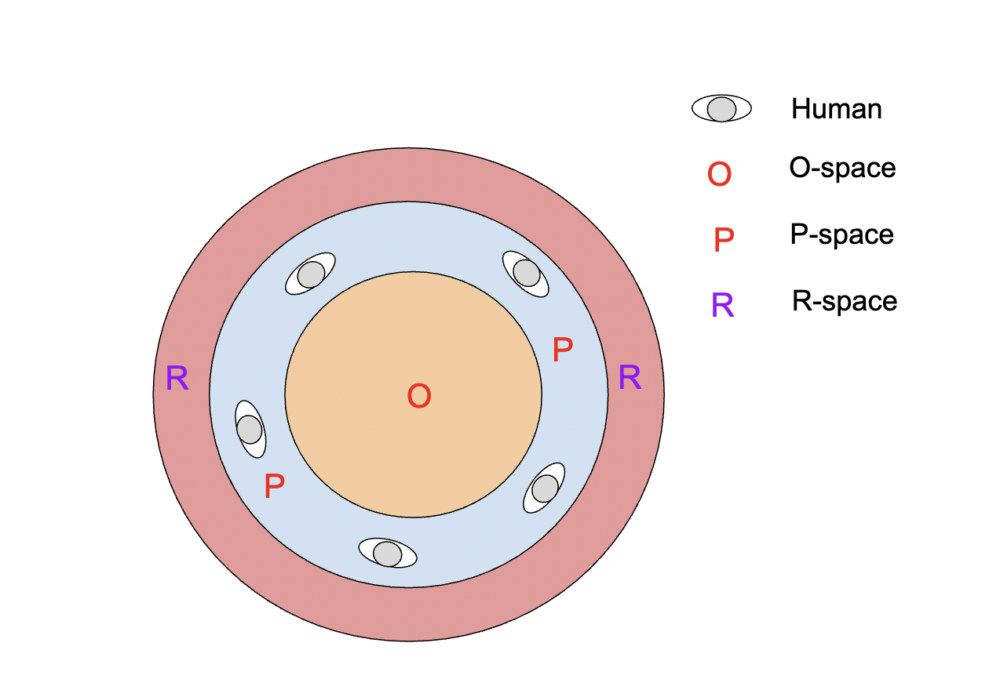

F-formation (facing formation) is defined as the set of patterns that are formed during social interactions of two or more people. A robot can join an existing group or go to a single person and form a new group. There are three social spaces related to f-formation, which are: O-space, P-space, and R-space. O-space is known as the joint transaction space which is the interaction space between participants. P-space is the space where active participants are standing. R-space is the area that surrounds the participants and is outside the interaction radius as shown in the above figure.

### Human proxemics 

Human proxemics is the study of how space is used between humans or how it is set between humans and others during interactions or performing an activity.The below figure shows the various specified distance ranges for different designated interaction types on the basis of intimacy level between the participating people. The distance ranges specified in green colored boxes are relevant to group/interaction and f-formation detection perspective. The blue-colored boxes signify distance ranges that are not generally seen in any f-formation.

    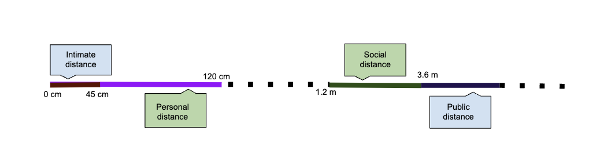

## Uniqueness of this work

    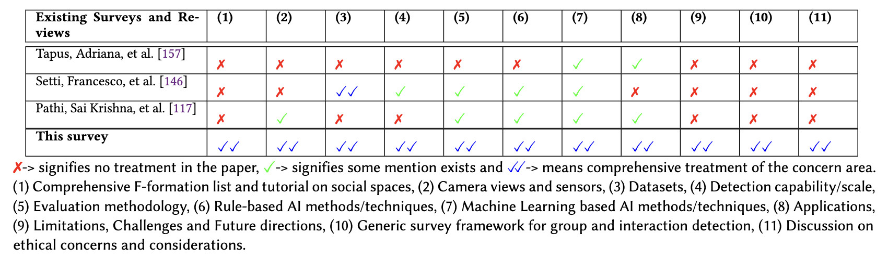

## Comprehensive list of f-formations which are/can be used for group and interaction detection tasks in vision and robotics

    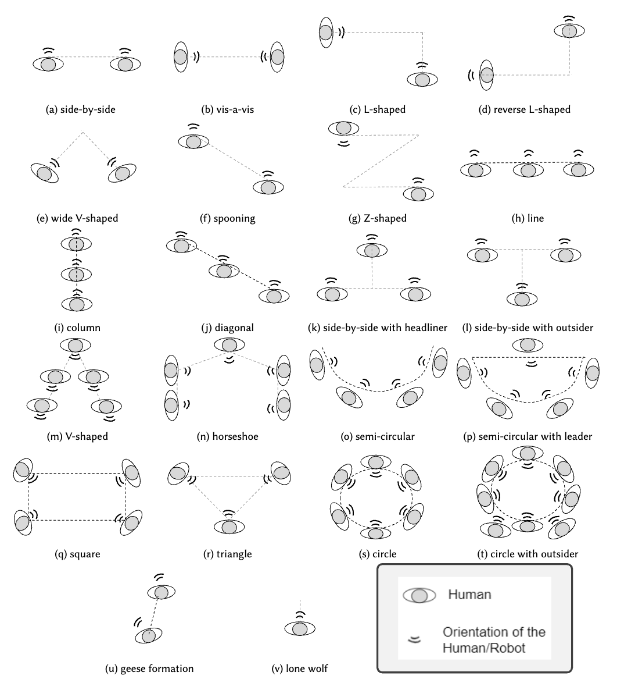

##  Comprehensive list of f-formations and their corresponding changed formations after a person/robot joins it. Also, the relevant possible trajectories a robot/person should take in each of the case

    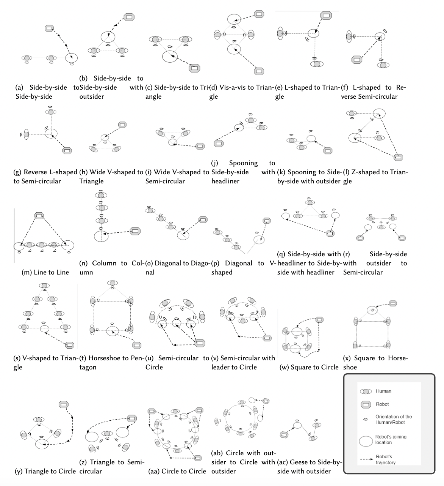

The table below lists the comprehensive list of formations before and after a robot/human has joined. The “*” signifies that the number is the minimum
requirement for that particular formation.

    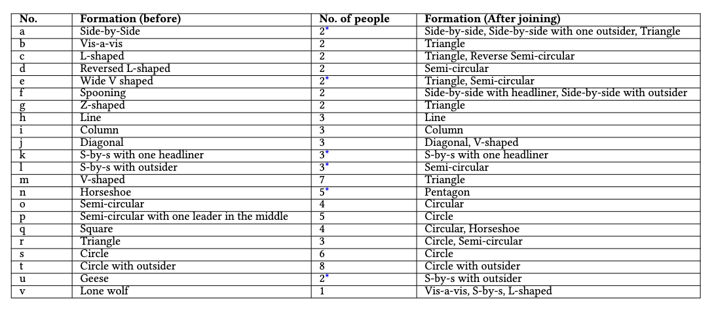

## Generic survey framework with possible concern areas

A possible separation of concerns into modules regarding social groups/interactions detection. The arrows correspond to the flow
of events/data in a typical group/interaction detection (f-formation) framework.

    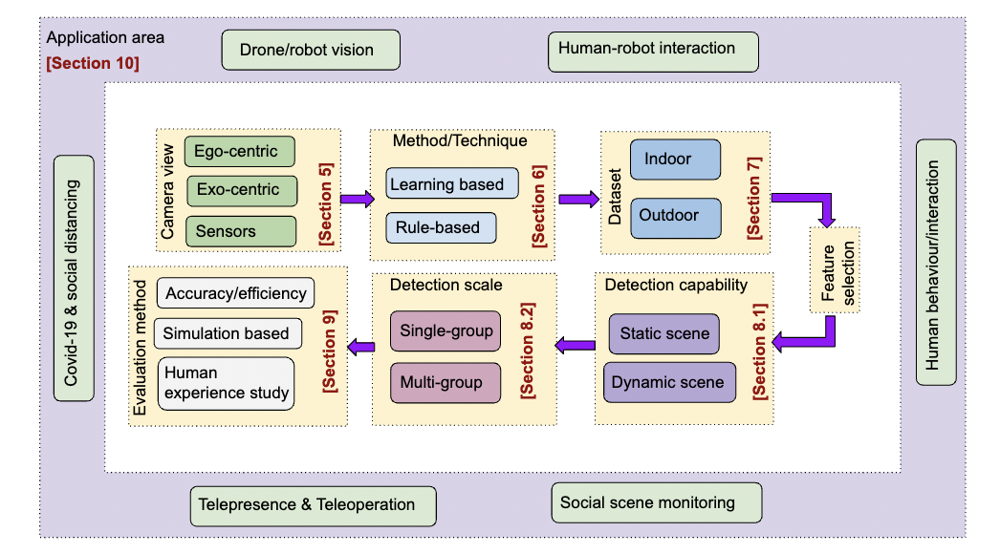

###  Taxonomy for cameras and sensors for scene capture. The leaf nodes give examples in each category

    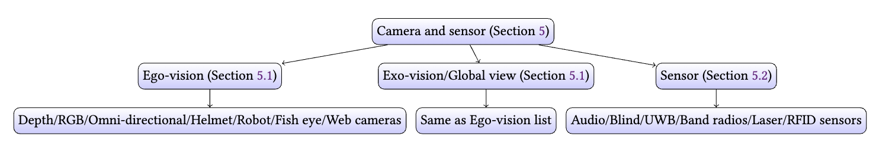

### Taxonomy for methods and approaches used for group and interaction detection

    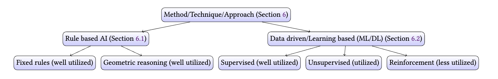

### Taxonomy for datasets surveyed for groups/interactions and formation detection

    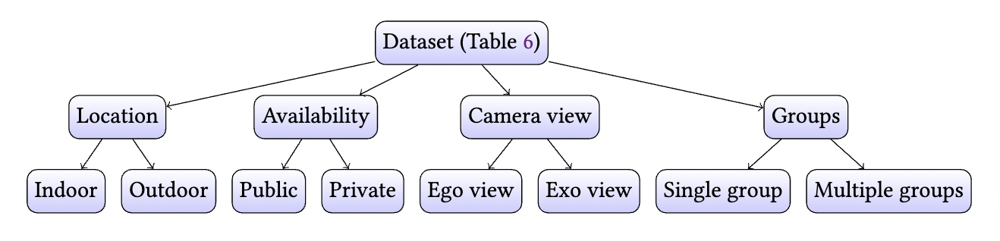

### Taxonomy for Detection capability and scale for groups/interactions and formations

    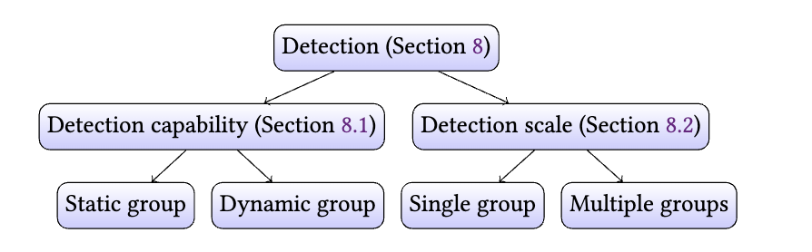

### Taxonomy for evaluation methodology for group/interaction and f-formation detection

    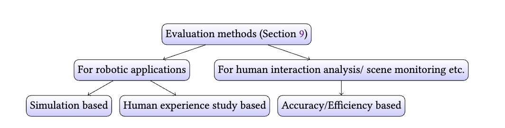

### Taxonomy for application areas for group/interaction and f-formation detection

    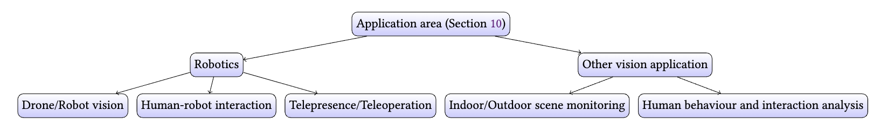

## LIMITATIONS, CHALLENGES AND FUTURE DIRECTIONS:

Limitations and challenge in the various concern areas of our survey framework.

    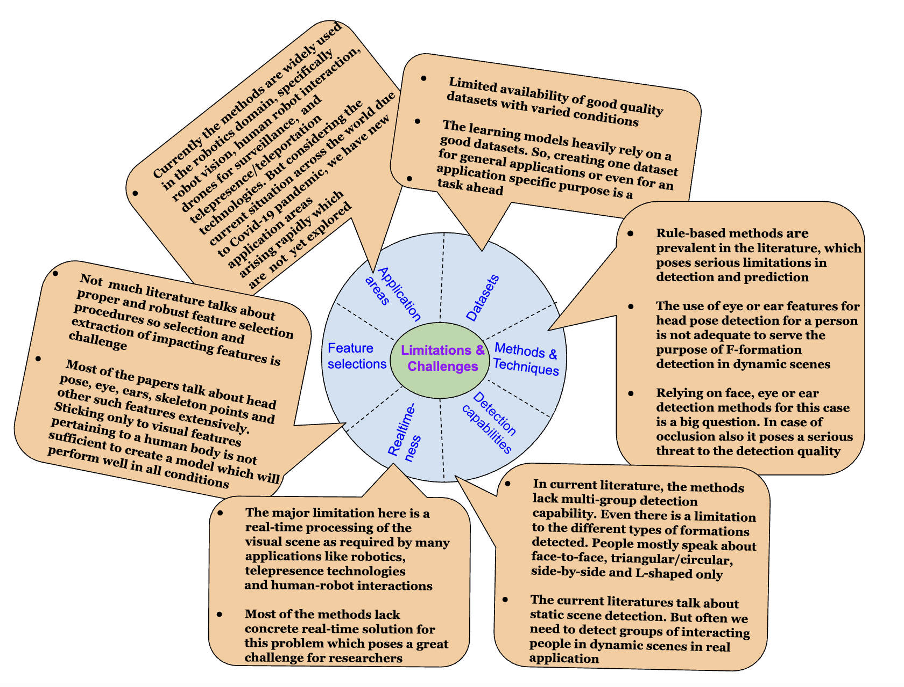

Future research directions/opportunities in the various concern areas of our survey framework.

    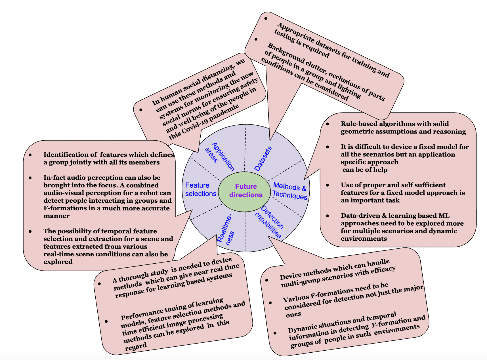

##  Citation 

If you find our work (i.e. the theory/concept, review, or framework) useful for your research or development activities, please consider citing our works as follows:

### Papers:
~~~
@article{barua2021detecting,
  title={Detecting socially interacting groups using f-formation: A survey of taxonomy, methods, datasets, applications, challenges, and future research directions},
  author={Barua, Hrishav Bakul and Mg, Theint Haythi and Pramanick, Pradip and Sarkar, Chayan},
  journal={arXiv preprint arXiv:2108.06181},
  year={2021}
}
~~~

~~~
@inproceedings{barua2020let,
  title={Let me join you! real-time f-formation recognition by a socially aware robot},
  author={Barua, Hrishav Bakul and Pramanick, Pradip and Sarkar, Chayan and Mg, Theint Haythi},
  booktitle={2020 29th IEEE International Conference on Robot and Human Interactive Communication (RO-MAN)},
  pages={371--377},
  year={2020},
  organization={IEEE}
}
~~~

~~~
@article{barua2020can,
  title={I can attend a meeting too! towards a human-like telepresence avatar robot to attend meeting on your behalf},
  author={Barua, Hrishav Bakul and Sarkar, Chayan and Kumar, Achanna Anil and Pal, Arpan and others},
  journal={arXiv preprint arXiv:2006.15647},
  year={2020}
}
~~~

### Patents:
~~~
@misc{barua2021system,
  title={System and method for enabling robot to perceive and detect socially interacting groups},
  author={Barua, Hrishav Bakul and Pramanick, Pradip and Sarkar, Chayan},
  year={2021},
  month=dec # "~30",
  publisher={Google Patents},
  note={US Patent App. 17/138,224}
}
~~~

~~~
@misc{sarkar2021attention,
  title={Attention shifting of a robot in a group conversation using audio-visual perception based speaker localization},
  author={Sarkar, Chayan and Barua, Hrishav Bakul and Pal, Arpan and Purushothaman, Balamuralidhar and Kumar, Achanna Anil},
  year={2021},
  month=sep # "~21",
  publisher={Google Patents},
  note={US Patent 11,127,401}
}
~~~
